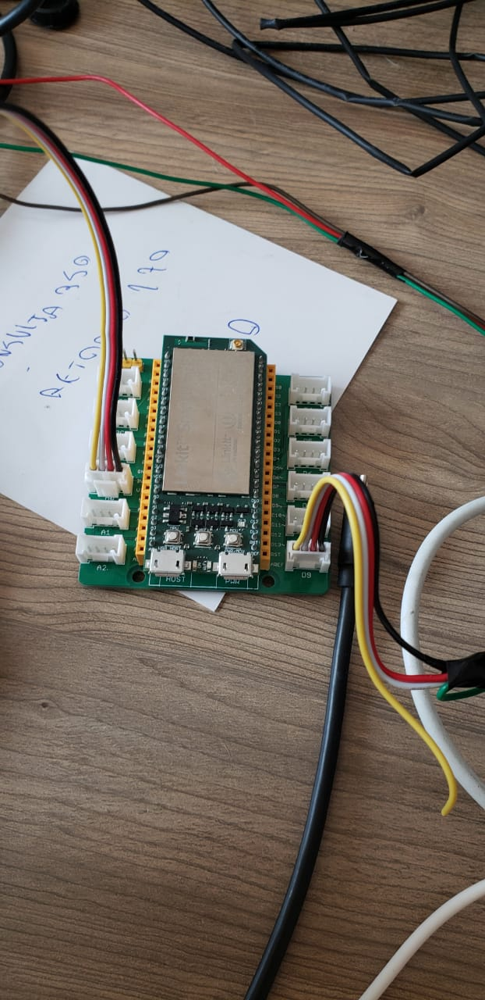
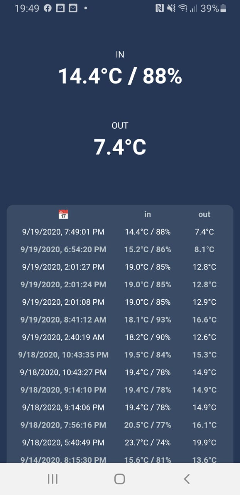

# Kombi Margarida IOT

IOT project for my Kombi "motorhome": **MARGARIDA**

More informations about Margarida's homemade construction can be found at:
- https://www.instagram.com/p/B-5YG3DA-0n/
- https://www.instagram.com/stories/highlights/18118392919032269/
- https://www.instagram.com/stories/highlights/17854754692769594/

## Module 1 - Temperature Monitor

The circuit uses:
- Linkit Smart DUO
- Step Down converter 6/24VDC para 5V 3A USB
- Temperature/humidity sensor DHT11 - Internal
- Temperature sensor DS18B20 - External

The project consists of three layers
- A firmware to obtain the current values of the sensors every 10 seconds;
- A node.js project to obtain these values ​​via serial communication and expose them to the HTTP endpoint;
- A WebAPP to obtain values from the node endpoint, shows values to user and stores it in local storage (NEED REFACTOR).

This project is designed to work only in offline mode, for this Linkit creates an internal WIFI connection.

Image of the circuit:

Image of the WebAPP:

